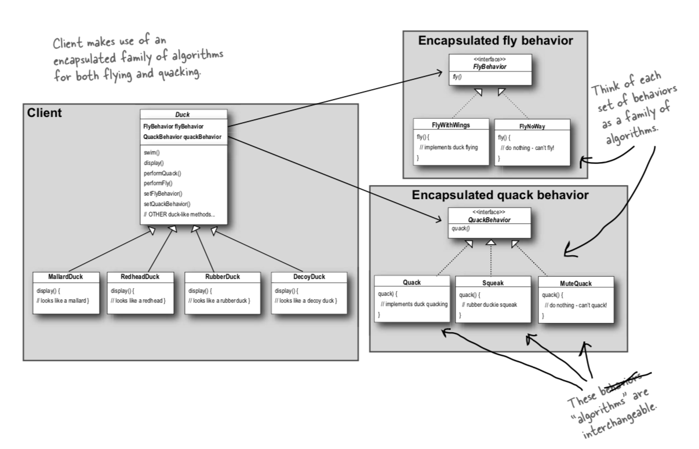

# Question 1

*Briefly explain why the first is "not working"*

---
*Working*
```java

class GameController{

static void setState(String gameStateName){
		System.out.println("setState( :"+gameStateName+")");

		gameState.doExitActivity();				// doExit on state we're leaving
		gameState = getState(gameStateName);	// change state
		gameState.doEnterActivity();			// doEnter on new state
    }

}

// ...

abstract class CrapsGameState{
	void play(int rolled){ 
		; //default: entry/doNothing	
	}
	
	void doEnterActivity(){
		; //default: entry/doNothing
	}
	void doExitActivity(){
		; //default: entry/doNothing
	}
	
	public String toString(){
		return this.getClass().getSimpleName();
	}
}

// ...

class WinState extends CrapsGameState{
    
	void doEnterActivity(){
		System.out.println( "WinState.doEnterActivity()" );
		System.out.println( "increase credits");
	}
	void doExitActivity(){ 
		System.out.println( "WinState.doExitActivity" );
		GameController.setState("CRAPS");
    }
}

class LoseState extends CrapsGameState{
    
	void doEnterActivity(){
		System.out.println( "LoseState.doEnterActivity()" );
		System.out.println( "decrease credits");
	}
	void doExitActivity(){ 
		System.out.println( "WinState.doExitActivity" );
		GameController.setState("CRAPS");
    }
}

```

*Not Working* 


```java
class GameController{

static void setState(String gameStateName){
		System.out.println("setState( :"+gameStateName+")");

		// MISSING EXIT ACTIVITY: gameState.doExitStateActivity();

		gameState = getState(gameStateName);	// change state
		gameState.doEnterActivity();			// doEnter on new state
    }

}

// ...

abstract class CrapsGameState{
	void play(int rolled){ 
		System.out.println( "CrapsGameState.play()" );
		if( rolled == 7 || rolled == 11){
			GameController.setState("WIN"); 
		
		}else if ( rolled == 2 || rolled == 3 || rolled == 12 ){
			GameController.setState("LOSE");
		}else {
			GameController.setState("POINT", rolled );
		}			
    }
	
	void doEnterStateActivity(){
		; //default: entry/doNothing
	}
	void doExitStateActivity(){
		; //default: entry/doNothing
	}
	
	public String toString(){
		return this.getClass().getSimpleName();
	}
}

// ...

class WinState extends CrapsGameState{
    
	void play(int rolled){ 
		System.out.println( "WinState.play()"+rolled );
		System.out.println( "increase credits");
		GameController.setState("CRAPS");
    }

    // MISSING ENTER AND EXIT ACTIVITIES
}

class LoseState extends CrapsGameState{
    
	void play(int rolled){ 
		System.out.println( "LoseState.play() - rolled: "+rolled );
		System.out.println( "decrease credits");
		GameController.setState("CRAPS");
    }

    // MISSING ENTER AND EXIT ACTIVITIES
}

```

In the "not-working" version, `doEnterStateActivity()` and `doExitStateActivity()` are not overridden in the subclasses. 

`gameState.doExitStateActivity()` is not called in the `GameController` class. Assuming it was added to the code, when `doExitStateActivity()` is called, the state would not be set back to "CRAPS" at the correct time as it is not overridden in the subclasses `WinState` and `LoseState`.  

Below is some output of running the "not-working" program. When the game is won, the state should be then set back to "CRAPS". However, because `WinState` only specifies a `play()` method and does not override the `doExitActivity()`, "CRAPS" is set one round late when playing a new game.

```bash

# output of running "not-working" program

Press Enter to Roll

Enter a number between 2 and 12 to test
4
CrapsState.play() - calling on...
CrapsGameState.play()
setState( :POINT)
Press Enter to Roll

Enter a number between 2 and 12 to test
5
PointState.play()
Press Enter to Roll

Enter a number between 2 and 12 to test
4
PointState.play()
setState( :WIN)
Press Enter to Roll

# ***** GAME PLAY BELOW IS INCORRECT BECAUSE OF REASON STATED ABOVE *******

Enter a number between 2 and 12 to test
7
WinState.play()7
increase credits
setState( :CRAPS)
Press Enter to Roll

Enter a number between 2 and 12 to test
7
CrapsState.play() - calling on...
CrapsGameState.play()
setState( :WIN)
Press Enter to Roll

```

---

# Question 2

**Compare the 02...String against the 03...Enum examples
and comment on which you think is the best approach and why
(use the term 'type-safe' in your response)**

---

I would say that using enums is better.   

**Definition:** An **enum** type is a special data type that enables for a variable to be a set of predefined constants *(https://docs.oracle.com/javase/tutorial/java/javaOO/enum.html)*.

According to the java documentation 'You should use enum types any time you need to represent a fixed set of constants.' Because enums are a type, if there is an error, it will occur during compile time and not at runtime like the example that uses strings i.e. it is type-safe.  

**Type safety** means that the compiler will validate types while compiling, and throw an error if you try to assign the wrong type to a variable. *(https://stackoverflow.com/questions/260626/what-is-type-safe)*

```java

// example using enums

// ...

enum StateName{ CRAPS, POINT, WIN, LOOSE };
class GameController{
static Map<StateName, CrapsGameState> possibleStates = new HashMap<StateName, CrapsGameState>();
static CrapsGameState gameState;
	
	GameController(){
		possibleStates.put( StateName.CRAPS, new CrapsState() );
		possibleStates.put( StateName.POINT, new PointState() );
		possibleStates.put( StateName.WIN, 	 new WinState() );
		possibleStates.put( StateName.LOOSE, new LooseState() );
		gameState = possibleStates.get(StateName.CRAPS);
	}

	// ...

}

// ...

```

```java

// example using string

// ...

class GameController{
static Map<String, CrapsGameState> possibleStates = new HashMap<String, CrapsGameState>();
static CrapsGameState gameState;
	
	GameController(){
		possibleStates.put( "CRAPS", new CrapsState() );
		possibleStates.put( "POINT", new PointState() );
		possibleStates.put( "WIN", new WinState() );
		possibleStates.put( "LOSE", new LoseState() );
		gameState = possibleStates.get("CRAPS");
	}

	// ...
}

// ...

```

---

# Question 3

**Briefly compare and contrast the State design pattern
against the Strategy design pattern. Use code and/or UML
diagrams to expalin the difference between the two patterns.**

---

## Strategy Pattern VS State Pattern

*Head First Design Patterns pg411*

### State Pattern,

* a set of behaviors encapsulated in state objects - at any time the context is delegating to one of those states
* the current state changes across the set of state objects to reflect the internal state of the context - context’s behavior changes over time  
* The client usually knows very little about the state objects
* The State Pattern is an alternative to putting lots of conditionals in your context (if statements) 
* by encapsulating the behaviors within state objects, you can change the state object in context to change its behavior
* **Encapsulate interchangeable behaviors and use delegation to decide which behavior to use**

#### Using the example of the Craps simulator from this weeks lab

1) list all states

* craps
* point
* win
* lose

2) create state objects/ `CrapsGameState` objects to hold states

```java

class GameController{
	
// state objects
static Map<String, CrapsGameState> possibleStates = new HashMap<String, CrapsGameState>();
static CrapsGameState gameState;

	GameController(){

		possibleStates.put( "CRAPS", new CrapsState() );
		possibleStates.put( "POINT", new PointState() );
		possibleStates.put( "WIN", new WinState() );
		possibleStates.put( "LOSE", new LoseState() );
		gameState = possibleStates.get("CRAPS");

	}

    //  ...
}

```

3) list all actions:

* play
* enter activity
* exit activity

4) define a State interface that contains a method for every action - below example has used an abstract class.

```java

// Head First Design Patterns pg399 specifies to use 
// an interface/abstract class

abstract class CrapsGameState{
	void play(int rolled){ 
		; //default: entry/doNothing	
	}
	
	void doEnterActivity(){
		; //default: entry/doNothing
	}
	void doExitActivity(){
		; //default: entry/doNothing
	}
	
	public String toString(){
		return this.getClass().getSimpleName();
	}
}

```

5) implement/extend a State class for every state of the machine. These classes will be responsible for the behavior of the machine when it is in the corresponding state.

```java

class CrapsState extends CrapsGameState{
	void play(int rolled){ 
		// ...	
    }
}

class PointState extends CrapsGameState{

	// ...

	void play(int rolled){
		// ...		
    }
	
	void storePointValueAs(int rolled){
		// ...
	}
	void resetPointValue(){
		// ...
	}
}

class WinState extends CrapsGameState{
    
	void doEnterActivity(){
		// ...
	}
	void doExitActivity(){ 
		// ...
    }
}

class LoseState extends CrapsGameState{
    
	void doEnterActivity(){
		// ...
	}
	void doExitActivity(){ 
		// ...
    }
}

```

### Strategy Pattern

* the client usually specifies the strategy object that the context is composed with 
* while the pattern provides the flexibility to change the strategy object at runtime, often there is a strategy object that is most appropriate for a context object 
* Strategy Pattern is a flexible alternative to subclassing 
* With Strategy you can change the behavior by composing with a different object - not possible if inheritance is used to define the behavior of a class
* **Subclasses decide how to implement steps in an algorithm**

> The Strategy Pattern defines a family of algorithms, encapsulates each one, and makes them interchangeable. 
> Strategy lets the algorithm vary independently from clients that use it.
> *Head First Design Patterns pg24*

* Take what varies and “encapsulate” it so it won’t affect the rest of your code. Head First Design Patterns pg9*

#### Using the example of Duck simulator from a previous lab

1) List all constant behaviours

2) List all changing behaviours  

  * flying
  * quacking

3) implement the changing behaviuors as interfaces

```java

interface FlyBehavior {
	void fly();
}

interface QuackBehavior {
	void quack();
}

```

4) Inside the superclass, declare instance variables that are declared as the interface type to polymorphically reference the specific behavior type it would like at runtime

```java

abstract class Duck {

	// instance variables
	FlyBehavior flyBehavior;				
	QuackBehavior quackBehavior;			
 
 	Duck() {
		// ...
	}
	
// ...

}

```

5) Subclasses use behaviours specified by an interface, this way the implementation of the behaviour isn't locked into the class (Head First Design Patterns pg11).  
  * the superclass *delegates* behaviours to the subclasses

```java

abstract class Duck {

	// instance variables
	FlyBehavior flyBehavior;				
	QuackBehavior quackBehavior;			
 
 	Duck() {
		// ...
	}
	
// ...

	void fly() {
		flyBehavior.fly();		// "delegation"
	}
 
	void quack() {
		quackBehavior.quack();	// "delegation"

	}

}

```

6) instance variables are set (in subclasses)

```java


class MallardDuck extends Duck {
 
	MallardDuck() { 
		quackBehavior 	= new Quack();				//quackBehavior attribute is inherited
        flyBehavior 	= new FlyWithWings();		//flyBehavior attribute is inherited
	}
 
	// ...
}


```

7) allow for dynamic changes at run time for behaviours

```java

abstract class Duck {
	//choosing Composition over Inheritance: subclasses will inherit these attributes

	FlyBehavior flyBehavior;				
	QuackBehavior quackBehavior;			
 
 	
	
	// ...

	
	//set flyBehavior
	void setFlyBehavior(FlyBehavior flight){
		flyBehavior = flight;
	} 
	//set QuackBehavior
	void setQuackBehavior(QuackBehavior quack){
		quackBehavior = quack;
	}

```

```java

class FlyWithWings implements FlyBehavior {
	
	FlyWithWings(){
		System.out.println("\t with a "+this.getClass().getName());
	}
	
	public void fly() {
		System.out.println("<<FlyWithWings.fly(): flying>>");
	}
}

```




---

# State Pattern Notes

1) list all states

* craps
* point
* win
* lose

2) create state objects/ `CrapsGameState` objects to hold states

```java

class GameController{
	
// state objects
static Map<String, CrapsGameState> possibleStates = new HashMap<String, CrapsGameState>();
static CrapsGameState gameState;

	GameController(){

		possibleStates.put( "CRAPS", new CrapsState() );
		possibleStates.put( "POINT", new PointState() );
		possibleStates.put( "WIN", new WinState() );
		possibleStates.put( "LOSE", new LoseState() );
		gameState = possibleStates.get("CRAPS");

	}

	//  ...
}

```

3) list all actions:

* play
* enter activity
* exit activity

4) define a State interface that contains a method for every action

```java

// Head First Design Patterns pg399 specifies to use an interface 
// 'interface' is overloaded here as
// it can mean use an interface
// OR an abstract class

abstract class CrapsGameState{
	void play(int rolled){ 
		; //default: entry/doNothing	
	}
	
	void doEnterActivity(){
		; //default: entry/doNothing
	}
	void doExitActivity(){
		; //default: entry/doNothing
	}
	
	public String toString(){
		return this.getClass().getSimpleName();
	}
}

```

5) implement/extend a State class for every state of the machine. These classes will be responsible for the behavior of the machine when it is in the corresponding state.

```java

class CrapsState extends CrapsGameState{
	void play(int rolled){ 
		// ...	
    }
}

class PointState extends CrapsGameState{

	// ...

	void play(int rolled){
		// ...		
    }
	
	void storePointValueAs(int rolled){
		// ...
	}
	void resetPointValue(){
		// ...
	}
}

class WinState extends CrapsGameState{
    
	void doEnterActivity(){
		// ...
	}
	void doExitActivity(){ 
		// ...
    }
}

class LoseState extends CrapsGameState{
    
	void doEnterActivity(){
		// ...
	}
	void doExitActivity(){ 
		// ...
    }
}

```

> The State Pattern allows an object to alter its behavior when its internal state changes. 
> The object will appear to change its class.
> *Head First Design Patterns pg410*

* Because the pattern encapsulates state into separate classes and delegates to the object representing the current state, we know that behavior changes along with the internal state.
* Using composition to give the appearance of a class change by simply referencing different state objects.

**CONTEXT** - The Context is the class that can have a number of internal states i.e. `GameController`


---

*Head First Design Patterns pg423*

* The State Pattern allows an object to have many different behaviors that are based on its internal state.
* Unlike a procedural state machine, the State Pattern represents state as a full-blown class.
* The Context gets its behavior by delegating to the current state object it is composed with.
* By encapsulating each state into a class, we localize any changes that will need to be made.
* The State and Strategy Patterns have the same class diagram, but they differ in intent.
* Strategy Pattern typically configures Context classes with a behavior or algorithm.
* State Pattern allows a Context to change its behavior as the state of the Context changes.
* State transitions can be controlled by the State classes or by the Context classes.
* Using the State Pattern will typically result in a greater number of classes in your design.
* State classes may be shared among Context instances.
